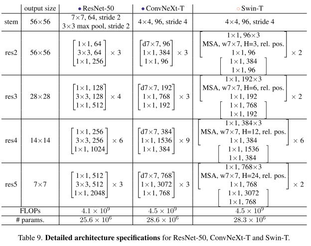
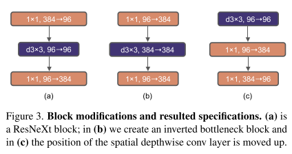
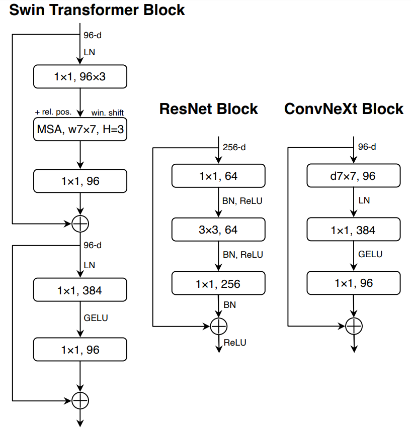

# ConvNext

ConvNeXt Re-implementation in PyTorch

Hierarchical Transformers (e.g., Swin Transformers[1]) has made Transformers highly competitive as a generic vision backbone and in a wide variety of vision tasks. A new paper from Facebook AI Research — “A ConvNet for the 2020s”[2] — gradually and systematically “modernizes” a standard ResNet[3] toward the design of a vision Transformer. The result is a family of pure ConvNet models dubbed ConvNeXt that compete favorably with Transformers in terms of accuracy and scalability.

## The “Modernization” Process

<!--   -->

(All models are trained and evaluated on ImageNet-1K. But for this case, i use CIFAR-10)

There's two important things in building a ConvNeXt. A <b>Macro</b> and <b>Micro</b> design.

## Macro Design

* 
Stage compute ratio: the number of blocks in each stage goes from (3, 4, 6, 3) to (3, 3, 9, 3) (see Table 9) to make the compute ratio 1:1:3:1.

* 
Patchifying stem: a 7x7 convolution with stride 2 followed by a 3x3 max pooling with stride 2 -> a 4x4 convolution with stride 4 (from overlapping to non-overlapping).

* 
ResNeXt-ify: use depthwise convolution and increase the network width.

* 
Inverted Bottleneck: instead of 384 -> 96 -> 384, the network widths (number of channels) becomes 96 -> 384 -> 96 ((a) to (b) in Fig 3). (Note that the number of channels in the last block of (b) is wrong. It should be 384 -> 96.)

* 
Larger kernel size: use a 7x7 convolution instead 3x3 and move the convolution layer up ((b) to (c) in Fig 3).

## Micro Design

* 
Replacing ReLU with GELU

* 
Fewer activation function: from three to only one between the two 1x1 layers. This has been proven to be very effective (a 0.7% boost).

* 
Fewer normalization layers: from three to only one between the 7x7 and the 1x1 layers.

* 
Substituting BN with LN: the Layer Normalization version perform slightly better.

* 
Separate downsampling layers: the downsampling layer consists of a Layer Normalization and a 2x2 convolution with stride 2. They are added between stages.* 
