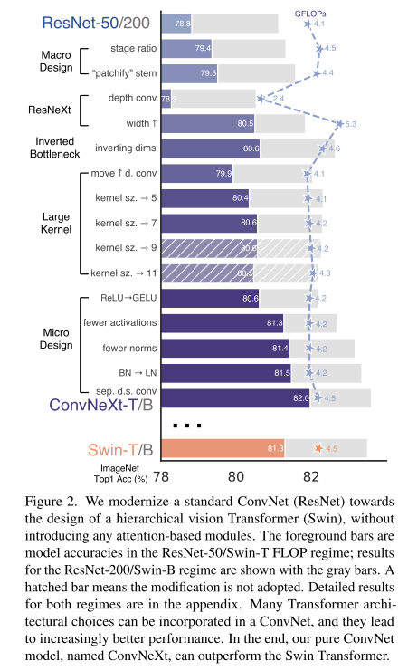

# ConvNext

ConvNeXt Re-implementation in PyTorch

Hierarchical Transformers (e.g., Swin Transformers[1]) has made Transformers highly competitive as a generic vision backbone and in a wide variety of vision tasks. A new paper from Facebook AI Research — “A ConvNet for the 2020s”[2] — gradually and systematically “modernizes” a standard ResNet[3] toward the design of a vision Transformer. The result is a family of pure ConvNet models dubbed ConvNeXt that compete favorably with Transformers in terms of accuracy and scalability.

## The “Modernization” Process

<!--   -->

(All models are trained and evaluated on ImageNet-1K. But for this case, i use CIFAR-10)

There's two important things in building a ConvNeXt. A <b>Macro</b> and <b>Micro</b> design.

